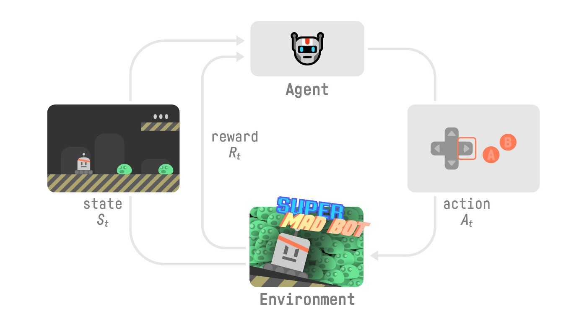
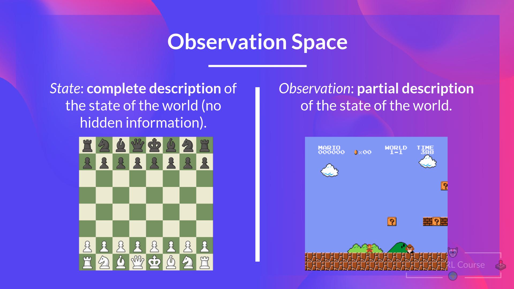
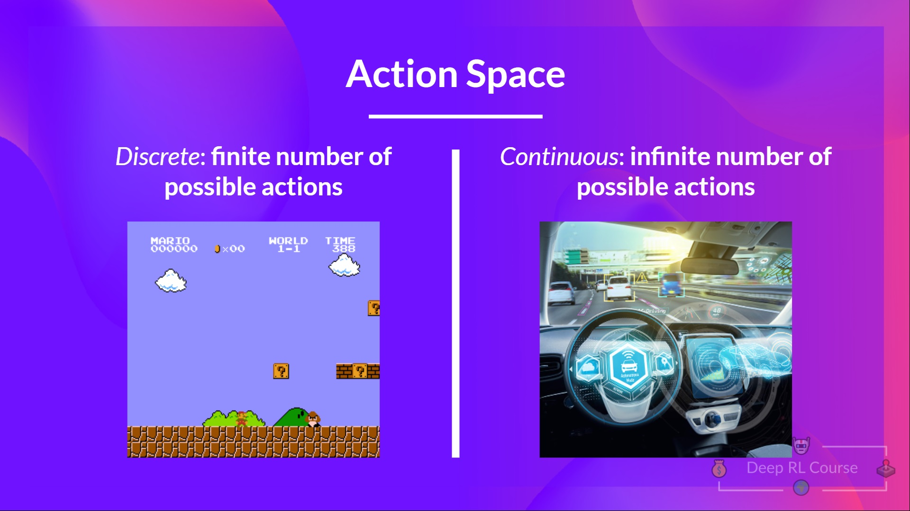
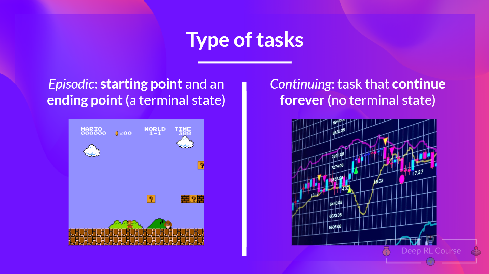

# RL

## A formal definition
*Reinforcement learning is a framework for solving control tasks (also called decision problems) by building agents that learn from the environment by interacting with it through trial and error and receiving rewards (positive or negative) as unique feedback.*
  

## The RL Process
To understand the RL process, let’s imagine an agent learning to play a game:
  

- Our Agent receives state **S0** from the Environment — we receive the first frame of our game (Environment).
- Based on that state **S0**, the Agent takes action **A0** — our Agent will move to the right.
- The environment goes to a new state **S1** — new frame.
- The environment gives some reward **R1** to the Agent — we’re not dead (Positive Reward +1).

**This RL loop outputs a sequence of state, action, reward and next state.**
  

## Observations/States Space
Observations/States are the information our agent gets from the environment. In the case of a video game, it can be a frame (a screenshot). In the case of the trading agent, it can be the value of a certain stock, etc.
  

  

## Action Space
The Action space is the set of all possible actions in an environment.
  

  

## Rewards and the discounting
The reward is fundamental in RL because it’s the only feedback for the agent. Thanks to it, our agent knows if the action taken was good or not.

**The agent’s goal is to maximize its cumulative reward, called the expected return.**

That’s why in Reinforcement Learning, to have the best behaviour, we aim to <ins>learn to take actions</ins> that maximize the expected cumulative reward.

To discount the rewards, we proceed like this:

- We define a discount rate called gamma. It must be between 0 and 1.
- Most of the time between 0.95 and 0.99.
- The larger the gamma, the smaller the discount. This means our agent cares more about the long-term reward.
- On the other hand, the smaller the gamma, the bigger the discount. This means our agent cares more about the short-term reward (the nearest cheese).

Our discounted expected cumulative reward is:
  

  

## Type of tasks
A task is an instance of a Reinforcement Learning problem. We can have two types of tasks: episodic and continuing.
  

  

## The Exploration/Exploitation trade-off

  
