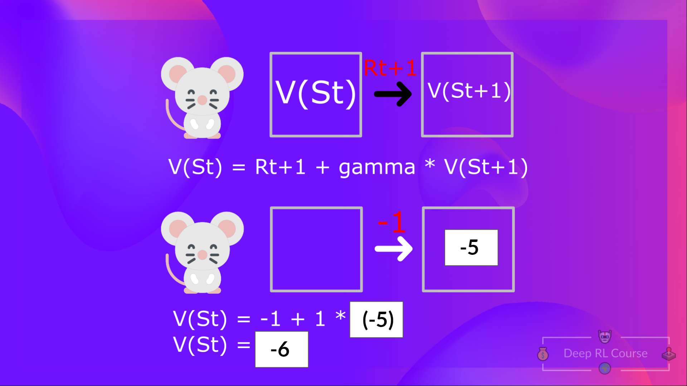
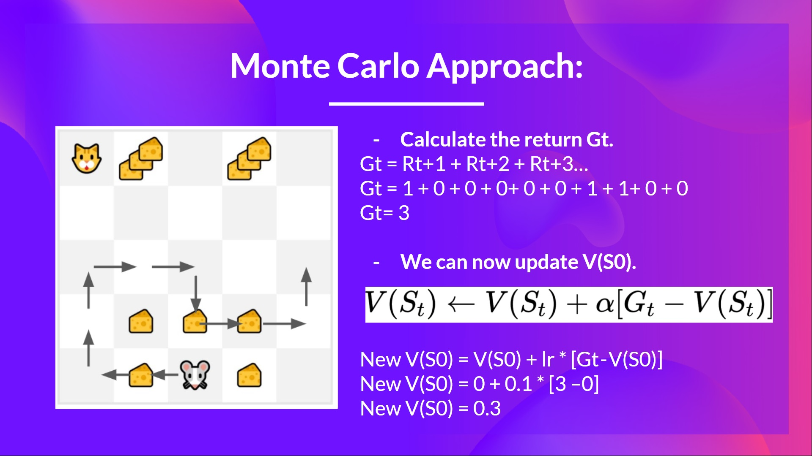
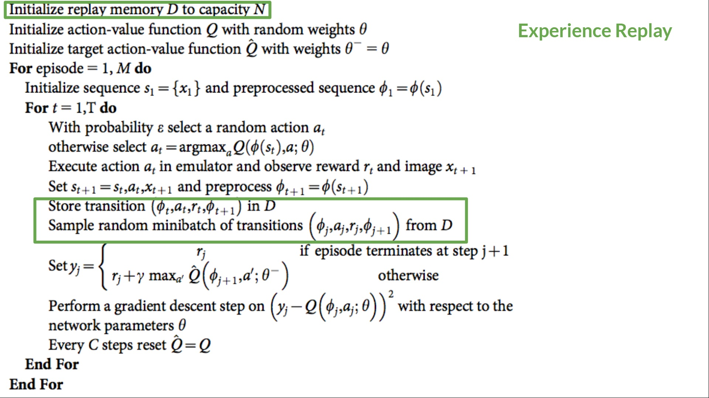

# RL

## A formal definition
*Reinforcement learning is a framework for solving control tasks (also called decision problems) by building agents that learn from the environment by interacting with it through trial and error and receiving rewards (positive or negative) as unique feedback.*
  

## The RL Process
To understand the RL process, let’s imagine an agent learning to play a game:
  

- Our Agent receives state **S0** from the Environment — we receive the first frame of our game (Environment).
- Based on that state **S0**, the Agent takes action **A0** — our Agent will move to the right.
- The environment goes to a new state **S1** — new frame.
- The environment gives some reward **R1** to the Agent — we’re not dead (Positive Reward +1).

**This RL loop outputs a sequence of state, action, reward and next state.**
  

### Observations/States Space
Observations/States are the information our agent gets from the environment. In the case of a video game, it can be a frame (a screenshot). In the case of the trading agent, it can be the value of a certain stock, etc.
  

  

### Action Space
The Action space is the set of all possible actions in an environment.
  

  

### Rewards and the discounting
The reward is fundamental in RL because it’s the only feedback for the agent. Thanks to it, our agent knows if the action taken was good or not.

**The agent’s goal is to maximize its cumulative reward, called the expected return.**

That’s why in Reinforcement Learning, to have the best behaviour, we aim to <ins>learn to take actions</ins> that maximize the expected cumulative reward.

To discount the rewards, we proceed like this:

- We define a discount rate called gamma. It must be between 0 and 1.
- Most of the time between 0.95 and 0.99.
- The larger the gamma, the smaller the discount. This means our agent cares more about the long-term reward.
- On the other hand, the smaller the gamma, the bigger the discount. This means our agent cares more about the short-term reward (the nearest cheese).

Our discounted expected cumulative reward is:
  

  

### Type of tasks
A task is an instance of a Reinforcement Learning problem. We can have two types of tasks: episodic and continuing.
  

  

### The Exploration/Exploitation trade-off

  

## Solving RL problems
How do we solve the RL problem?

In other words, how do we build an RL agent that can select the actions that maximize its expected cumulative reward?

### The Policy π: the agent’s brain
This Policy is the function we want to learn, our goal is to find the optimal policy π*, the policy that maximizes expected return when the agent acts according to it.
We find this π* through training.

There are two approaches to train our agent to find this optimal policy π*:

1. (Directly) Policy-Based Methods
   In Policy-Based methods, we learn a policy function directly.
   
   This function will define a mapping from each state to the best corresponding action. Alternatively, it could define a probability     distribution over the set of possible actions at that state.
   We have two types of policies:
   - Deterministic: a policy in a given state will always return the same action.
     
      

   - Stochastic: outputs a probability distribution over actions.
     
      
3. (Indirectly) Value-Based Methods
   In value-based methods, instead of learning a policy function, we learn a value function that maps a state to the expected value of being at that state.

   The value of a state is the expected discounted return the agent can get if it starts in that state, and then acts according to our policy.

   “Act according to our policy” just means that our policy is “going to the state with the highest value”.

    
   
   

Most of the time, in value-based methods, you’ll use an *Epsilon-Greedy Policy* that handles the exploration/exploitation trade-off.
  

## Q-Learning (value-based)
### Value-based methods
We have two types of value-based functions:

We see that the difference is:

- For the **state-value** function, we calculate the value of a state **St**
- For the **action-value** function, we calculate the value of the state-action pair **(St , At)**, hence the value of taking that action at that state.

However, the problem is that to calculate EACH value of a state or a state-action pair, we need to sum all the rewards an agent can get if it starts at that state.

This can be a computationally expensive process, and that’s where the **Bellman equation** comes in to help us.
  

### The Bellman Equation: simplify our value estimation
The idea of the Bellman equation is that instead of calculating each value as the sum of the expected return, which is a long process, we calculate the value as the sum of immediate reward + the discounted value of the state that follows.

  

### Monte Carlo vs Temporal Difference Learning
There are two types of methods to update the value function: Monte Carlo and Temporal Difference Learning

- Monte Carlo: learning at the end of the episode
  
  
  

- Temporal Difference Learning: learning at each step
  
  
  

Formulas:

**bootstrapping**

In general, *bootstrapping* in RL means that you update a value based on some estimates and not on some exact values. E.g. In TD(0), the return starting from state *s* is estimated (bootstrapped) by *Rt+1+γV(St+1)* while in MC we use the exact return *Gt*.
  

### What is Q-Learning?
Q-Learning is an <ins>off-policy</ins> <ins>value-based</ins> method that uses a <ins>TD</ins> approach to train its <ins>action-value</ins> function

**Algorithm:**

**Greedy strategy:**

This strategy always chooses the action that is expected to lead to the highest reward, based on the current knowledge of the environment.

**Epsilon-greedy strategy:**

The epsilon-greedy strategy is a policy that handles the exploration/exploitation trade-off. At the beginning of the training, the probability of doing exploration will be huge since ɛ is very high, so most of the time, we’ll explore. But as the training goes on, and consequently our Q-table gets better and better in its estimations, we progressively reduce the epsilon value since we will need less and less exploration and more exploitation.

**Off-policy vs On-policy:**

It's about the sameness between the action choosing in *"training time"* and the action choosing when *"using the model"*.

  

## Deep Q-Learning

### The Deep Q-Network (DQN)
This is the architecture of our Deep Q-Learning network:

  

**Preprocessing the input and temporal limitation:**

- We reduce the state space to 84x84 and grayscale it.
- We can also crop a part of the screen in some games if it does not contain important information.
- We stack frames together because it helps us handle the problem of temporal limitation.
  Temporal Limitation is a difficulty presented when the environment state is represented by frames. A frame by itself does not provide temporal information. In order to obtain temporal information, we need to stack a number of frames together.

### The Deep Q-Learning Algorithm
#### Fixed Q-Target
First, look at the updating formula for Q-value estimation by Temporal Difference from Q-learning algorithm:

As you see, we need to calculate the TD Error in each step. In other words, we create a **loss function** that compares our **Q-value prediction** and the **Q-target** and uses gradient descent to update the weights of our Deep Q-Network to approximate our Q-values better.

When we want to calculate the TD error (aka the loss), we calculate the difference between the TD target (Q-Target) and the current Q-value (estimation of Q). But we don’t have any idea of the real TD target. We need to estimate it. Using the Bellman equation, we saw that the TD target is just the reward of taking that action at that state plus the discounted highest Q value for the next state.

Therefore, at every step of training, both our Q-values and the target values shift. We’re getting closer to our target, but the target is also moving. It’s like chasing a moving target! This can lead to significant oscillation in training.

So, what we see in the pseudo-code is that we:

- Use a **separate network with fixed parameters** for estimating the TD Target
- **Copy the parameters from our Deep Q-Network every C steps** to update the target network.

#### Sampling and Training
The Deep Q-Learning training algorithm has two phases:
- **Sampling:** We perform actions and store the observed experience tuples in a *replay memory*.
- **Training:** Select a small batch of tuples randomly from the *replay memory* and learn from this batch using a gradient descent update step.

#### Replay Memory and Experience Replay
- Usually, in online reinforcement learning, the agent interacts with the environment, gets experiences (state, action, reward, and next state), learns from them (updates the neural network), and discards them. This is not efficient.
- A replay memory is created to save experiences samples that can be reused during training. This allows the agent to learn from the same experiences multiple times. Also, it helps the agent avoid forgetting previous experiences as it gets new ones.
- Random sampling from replay buffer allows to remove correlation in the observation sequences and prevents action values from oscillating or diverging catastrophically.
- In the Deep Q-Learning pseudocode, we initialize a replay memory buffer D with capacity N (N is a hyperparameter that you can define). We then store experiences in the memory and sample a batch of experiences to feed the Deep Q-Network during the training phase.

  

## Policy-gradient Methods (policy-based)
With policy-based methods, we want to optimize the policy directly without having an intermediate step of learning a value function.

### Advantages and Disadvantages
pros:
- Policy-gradient methods can learn a stochastic policy while value functions can’t:
   - We don’t need to implement an exploration/exploitation trade-off by hand.
   - We also get rid of the problem of perceptual aliasing. Perceptual aliasing is when two states seem (or are) the same but need different actions.
- Policy-gradient methods are more effective in high-dimensional action spaces and continuous actions spaces.

cons:
- Frequently, policy-gradient methods converges to a local maximum instead of a global optimum.
- Policy-gradient goes slower, step by step: it can take longer to train (inefficient).
- Policy-gradient can have high variance. We’ll see in the actor-critic unit why, and how we can solve this problem.

