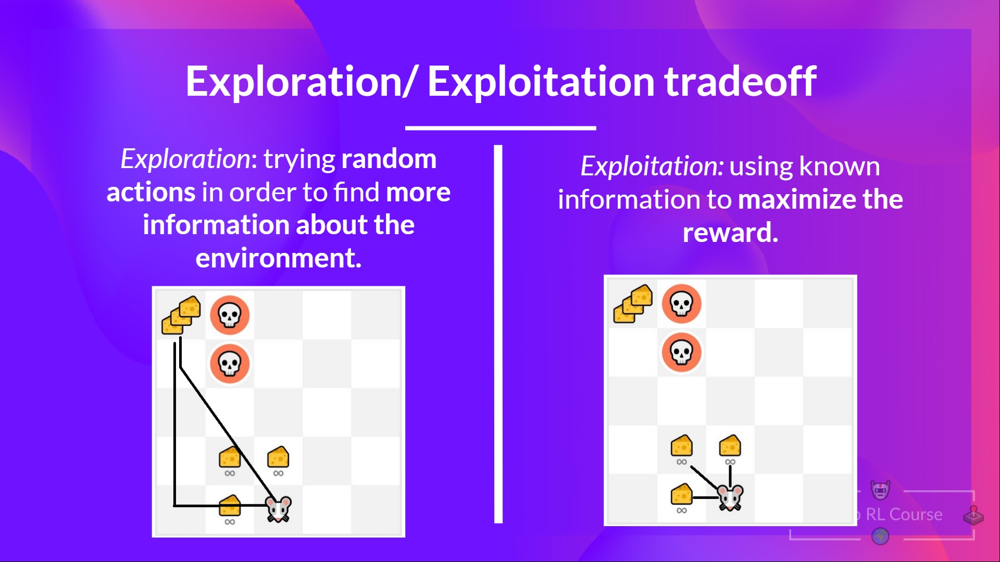
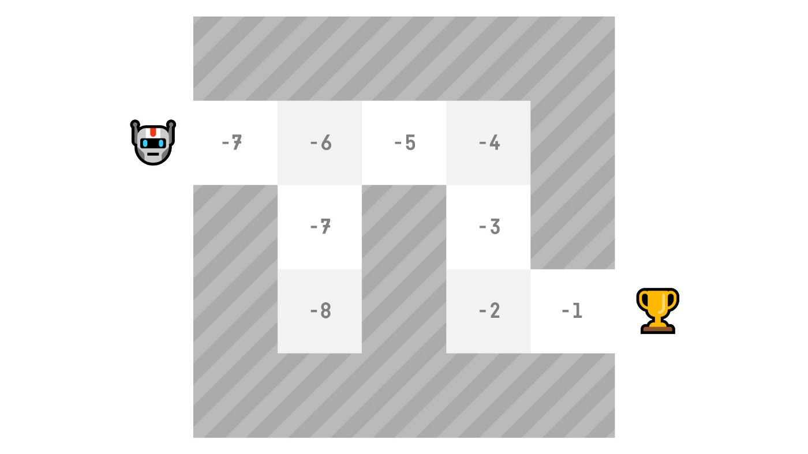

# RL

## A formal definition
*Reinforcement learning is a framework for solving control tasks (also called decision problems) by building agents that learn from the environment by interacting with it through trial and error and receiving rewards (positive or negative) as unique feedback.*
  

## The RL Process
To understand the RL process, let’s imagine an agent learning to play a game:
  

- Our Agent receives state **S0** from the Environment — we receive the first frame of our game (Environment).
- Based on that state **S0**, the Agent takes action **A0** — our Agent will move to the right.
- The environment goes to a new state **S1** — new frame.
- The environment gives some reward **R1** to the Agent — we’re not dead (Positive Reward +1).

**This RL loop outputs a sequence of state, action, reward and next state.**
  

### Observations/States Space
Observations/States are the information our agent gets from the environment. In the case of a video game, it can be a frame (a screenshot). In the case of the trading agent, it can be the value of a certain stock, etc.
  

  

### Action Space
The Action space is the set of all possible actions in an environment.
  

  

### Rewards and the discounting
The reward is fundamental in RL because it’s the only feedback for the agent. Thanks to it, our agent knows if the action taken was good or not.

**The agent’s goal is to maximize its cumulative reward, called the expected return.**

That’s why in Reinforcement Learning, to have the best behaviour, we aim to <ins>learn to take actions</ins> that maximize the expected cumulative reward.

To discount the rewards, we proceed like this:

- We define a discount rate called gamma. It must be between 0 and 1.
- Most of the time between 0.95 and 0.99.
- The larger the gamma, the smaller the discount. This means our agent cares more about the long-term reward.
- On the other hand, the smaller the gamma, the bigger the discount. This means our agent cares more about the short-term reward (the nearest cheese).

Our discounted expected cumulative reward is:
  

  

### Type of tasks
A task is an instance of a Reinforcement Learning problem. We can have two types of tasks: episodic and continuing.
  

  

### The Exploration/Exploitation trade-off

  

## Solving RL problems
How do we solve the RL problem?

In other words, how do we build an RL agent that can select the actions that maximize its expected cumulative reward?

### The Policy π: the agent’s brain
This Policy is the function we want to learn, our goal is to find the optimal policy π*, the policy that maximizes expected return when the agent acts according to it.
We find this π* through training.

There are two approaches to train our agent to find this optimal policy π*:

1. (Directly) Policy-Based Methods
   In Policy-Based methods, we learn a policy function directly.
   
   This function will define a mapping from each state to the best corresponding action. Alternatively, it could define a probability     distribution over the set of possible actions at that state.
   We have two types of policies:
   - Deterministic: a policy in a given state will always return the same action.
     
      

   - Stochastic: outputs a probability distribution over actions.
     
      
3. (Indirectly) Value-Based Methods
   In value-based methods, instead of learning a policy function, we learn a value function that maps a state to the expected value of being at that state.

   The value of a state is the expected discounted return the agent can get if it starts in that state, and then acts according to our policy.

   “Act according to our policy” just means that our policy is “going to the state with the highest value”.

    
   
   

Most of the time, in value-based methods, you’ll use an *Epsilon-Greedy Policy* that handles the exploration/exploitation trade-off.
  

## Q-Learning
### Value-based methods
We have two types of value-based functions:

We see that the difference is:

- For the **state-value** function, we calculate the value of a state **St**
- For the **action-value** function, we calculate the value of the state-action pair **(St , At)**, hence the value of taking that action at that state.
